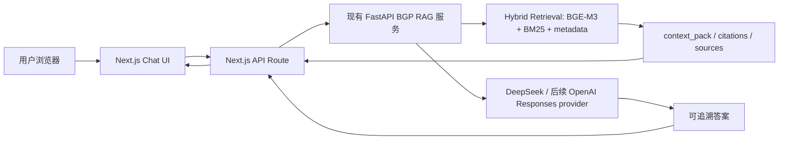

# 对话前端项目分支开发文档

## 1. 项目定位

本项目是一个独立产品化分支，不作为阶段四、阶段五或任何既有阶段的子阶段。它只消费现有知识库服务能力，不改变知识库构建流水线、混合检索逻辑、评测集和阶段验收标准。

目标是把当前已经完成的 BGP RAG 能力包装成一个 ChatGPT 类型的网页应用：用户通过对话界面提问，系统返回可追溯答案、引用、证据来源和检索状态。

## 2. 分支边界

### 2.1 纳入范围

- 新建独立 Git 分支：`codex/project-chat-frontend`
- 新建独立前端应用目录，建议为仓库根目录下的 `chat_frontend/`
- 复用现有 FastAPI 服务：
  - `POST /api/v1/rag/answer`
  - `GET /api/v1/hybrid/context-pack`
  - `GET /api/v1/hybrid/search`
  - `GET /health`
- 复用现有模型与检索能力：
  - DeepSeek 生成能力
  - SiliconFlow BGE-M3 embedding
  - BM25 / 关键词检索
  - metadata 排序
  - citation / context pack
- 使用成熟模板与组件，不从零搭建聊天 UI。

### 2.2 明确不纳入范围

- 不修改阶段 4.5 的验收配置。
- 不把本项目写入 `docs/stages/`。
- 不重写 BGE-M3 索引构建逻辑。
- 不重写混合检索排序逻辑。
- 不把 DeepSeek、SiliconFlow、OpenAI API key 写入前端。
- 不在浏览器直接调用任何模型 API。
- 不写回知识库实体、关系、chunk 或 published 产物。
- 第一版不接入本地模型。
- 第一版不做多租户权限系统。
- 第一版不做文件上传知识库。
- 第一版不迁移到 OpenAI File Search。

## 3. 推荐技术栈

| 层级 | 技术 | 用途 | 选择理由 |
| --- | --- | --- | --- |
| 前端框架 | Next.js App Router | 对话网站主体 | 适合服务端路由、API route 和流式响应 |
| 对话能力 | Vercel AI SDK | 消息流、streaming、模型 provider 抽象 | 直接复用成熟 chat 模式，减少自写流式协议 |
| UI 基础 | Vercel AI Chatbot 模板、shadcn/ui、Radix UI | 对话布局、按钮、输入框、侧边栏、弹窗 | 现成组件成熟，不从零搭建 |
| 样式 | Tailwind CSS | 快速实现一致 UI | 与 Vercel 模板天然匹配 |
| 生成模型 | DeepSeek 优先，OpenAI Responses API 作为可选 provider | 生成最终答案 | 兼容现有 key 和后续模型切换 |
| 检索服务 | 现有 FastAPI | BGP RAG 检索、context pack、引用 | 保留阶段 4.5 成果 |
| 历史记录 | 第一版 localStorage；第二版 Postgres/Neon 或 SQLite | 保存会话和消息 | 先降低复杂度，后续再持久化 |
| 测试 | Vitest / Playwright / pytest | 前端单测、端到端、后端契约测试 | 覆盖 UI、API 适配和安全边界 |

## 4. 总体架构



第一版优先采用“前端调用 Next.js API route，Next.js API route 再代理现有 FastAPI”的结构。这样浏览器不会接触模型 key，也可以在 Next.js 层统一处理流式输出、错误转换、会话格式和引用展示。

## 5. 目录规划

建议新增以下目录和文件：

```text
chat_frontend/
  app/
    page.tsx
    layout.tsx
    api/
      chat/
        route.ts
      rag/
        context-pack/
          route.ts
  components/
    chat/
      chat-shell.tsx
      message-list.tsx
      message-composer.tsx
      citation-panel.tsx
      retrieval-status.tsx
      example-prompts.tsx
    layout/
      app-sidebar.tsx
      top-status-bar.tsx
  lib/
    bgp-rag-client.ts
    chat-types.ts
    citation-utils.ts
    env.ts
  tests/
    bgp-rag-client.test.ts
    chat-api-route.test.ts
  package.json
  next.config.ts
  tsconfig.json
  .env.example
```

现有后端目录保持不动：

```text
bgp_knowledge_base/
  service/
  scripts/
  config/
  published/
  datasets/
  reports/
```

## 6. 数据流

### 6.1 普通提问

1. 用户在 `ChatUI` 输入问题。
2. 前端把消息发送给 `POST /api/chat`。
3. `app/api/chat/route.ts` 提取最后一个用户问题。
4. Next.js 服务端调用现有 FastAPI：
   - 第一版可直接调用 `POST /api/v1/rag/answer`
   - 如需更细粒度控制，可先调用 `GET /api/v1/hybrid/context-pack`
5. FastAPI 返回：
   - `answer`
   - `answer_status`
   - `citations`
   - `context_pack`
   - `retrieval metadata`
6. Next.js route 将结果转换为前端消息格式。
7. 前端展示答案、引用和检索状态。

### 6.2 无证据问题

1. FastAPI 返回 `answer_status=no_evidence`。
2. 前端不伪造答案。
3. UI 展示拒答状态、检索数量和建议改写问题。
4. 会话记录中保留本轮问题和拒答原因。

### 6.3 LLM 不可用

1. FastAPI 返回 `answer_status=llm_unavailable`。
2. 前端展示模型不可用提示。
3. 若 context pack 存在，仍展示可查看的检索证据。
4. 不重试到浏览器侧模型 API。

## 7. API 契约

### 7.1 Next.js 前端入口

`POST /api/chat`

请求：

```json
{
  "messages": [
    {"role": "user", "content": "什么是 route leak？"}
  ],
  "options": {
    "limit": 8,
    "showCitations": true
  }
}
```

响应第一版可以是普通 JSON：

```json
{
  "message": {
    "role": "assistant",
    "content": "Route leak 是..."
  },
  "answerStatus": "answered",
  "citations": [],
  "retrieval": {
    "vectorStatus": "complete",
    "resultCount": 8
  }
}
```

第二版再升级为 Vercel AI SDK stream protocol，支持 token 级流式输出。

### 7.2 后端环境变量

`chat_frontend/.env.example`：

```bash
BGP_RAG_BASE_URL=http://127.0.0.1:8000
CHAT_PROVIDER=bgp_fastapi_rag
OPENAI_API_KEY=
DEEPSEEK_API_KEY=
```

说明：

- `BGP_RAG_BASE_URL` 指向现有 FastAPI 服务。
- 第一版不要求 `OPENAI_API_KEY`。
- 若后续接 OpenAI Responses API，只能在 Next.js 服务端读取 `OPENAI_API_KEY`。
- 不允许任何 `NEXT_PUBLIC_*_API_KEY`。

## 8. UI 设计要求

### 8.1 首屏

首屏就是对话工作台，不做营销落地页。

布局：

- 左侧：会话列表、示例问题、服务状态。
- 中间：消息流。
- 底部：输入框、发送按钮、停止按钮。
- 右侧或折叠面板：引用、context pack、检索细节。

### 8.2 消息展示

用户消息：

- 显示原始问题。
- 可复制。

助手消息：

- 显示答案正文。
- 显示状态标签：
  - `answered`
  - `no_evidence`
  - `llm_unavailable`
  - `error`
- 显示引用数量。
- 显示检索方法和来源类型。

### 8.3 引用展示

每条引用至少展示：

- source id
- chunk id
- title
- source type
- score 或 ranking 信息
- content preview

可选跳转：

- `/sources/{source_id}`
- 现有 FastAPI 的 source 页面

## 9. 模型与检索策略

第一版策略：

- 前端不直接调用模型。
- 生成答案继续复用现有 FastAPI `rag_answer`。
- embedding 继续使用 SiliconFlow BGE-M3。
- 检索继续使用现有混合检索。

第二版策略：

- Next.js API route 可支持 provider 切换。
- `CHAT_PROVIDER=bgp_fastapi_rag`：完全复用 FastAPI 生成答案。
- `CHAT_PROVIDER=openai_responses_with_bgp_context`：Next.js 先取 FastAPI context pack，再用 OpenAI Responses API 生成流式答案。
- `CHAT_PROVIDER=deepseek_with_bgp_context`：Next.js 先取 FastAPI context pack，再用 DeepSeek 生成流式答案。

优先顺序：

1. 先做 `bgp_fastapi_rag`，保证最快可用。
2. 再做 `deepseek_with_bgp_context`，改善流式体验。
3. 最后做 `openai_responses_with_bgp_context`，验证 Responses API 和工具调用扩展。

## 10. 开发任务拆解

### 任务 1：创建独立项目分支

- 创建 Git 分支：`codex/project-chat-frontend`
- 不从阶段 4.5 分支中拆阶段文档。
- 保留当前 FastAPI 服务作为依赖。

验收：

- `git status --short --branch` 显示当前位于 `codex/project-chat-frontend`。
- `docs/stages/` 没有新增对话前端阶段文档。

### 任务 2：引入 Next.js Chatbot 模板

- 使用 Vercel Chatbot 模板作为基础。
- 裁剪不需要的功能：
  - 文件上传
  - 多模态
  - 复杂账号系统
  - 生产级计费或多租户能力
- 保留：
  - 对话布局
  - 消息流
  - 输入框
  - 基础会话列表
  - shadcn/ui 组件

验收：

- `chat_frontend/` 可本地启动。
- 首页是对话工作台。
- 不出现模板默认品牌残留。

### 任务 3：实现 BGP RAG 客户端

新增 `chat_frontend/lib/bgp-rag-client.ts`：

- `health()`
- `answerQuestion(query, limit)`
- `getContextPack(query, limit)`
- `hybridSearch(query, limit)`

要求：

- 统一处理 FastAPI 不可用。
- 统一处理 timeout。
- 不吞掉 `answer_status`。
- 不把后端错误显示为成功答案。

验收：

- 单元测试覆盖成功、无证据、服务不可用三类结果。

### 任务 4：实现 `/api/chat`

新增 `chat_frontend/app/api/chat/route.ts`：

- 接收前端消息。
- 提取最后一条用户消息。
- 调用 `bgp-rag-client.answerQuestion()`。
- 转换为前端消息格式。
- 第一版可返回 JSON，第二版再升级为 stream。

验收：

- 前端可通过 `/api/chat` 得到答案。
- 无证据问题返回明确拒答。
- FastAPI 未启动时返回明确错误。

### 任务 5：实现对话页面

新增或修改：

- `chat_frontend/app/page.tsx`
- `chat_frontend/components/chat/chat-shell.tsx`
- `chat_frontend/components/chat/message-list.tsx`
- `chat_frontend/components/chat/message-composer.tsx`
- `chat_frontend/components/chat/citation-panel.tsx`
- `chat_frontend/components/chat/retrieval-status.tsx`

验收：

- 可输入中文和英文问题。
- 回答后展示引用。
- 无证据时展示拒答。
- 页面在移动端不重叠。

### 任务 6：本地会话历史

第一版使用 `localStorage`：

- 保存 conversation id。
- 保存 messages。
- 保存 citations metadata。
- 支持清空会话。

验收：

- 刷新页面后最近会话仍在。
- 清空后本地记录删除。
- 不保存任何 API key。

### 任务 7：流式输出升级

在第一版稳定后执行：

- 如果 provider 是 FastAPI `rag_answer`，可以先做“伪流式”：服务端拿到完整答案后分片输出。
- 如果 provider 是 DeepSeek 或 OpenAI Responses，则用真实 streaming。
- 前端使用 Vercel AI SDK 的消息流能力。

验收：

- 用户能看到逐步输出。
- 错误时不会留下半条成功消息。
- 引用在答案完成后稳定展示。

### 任务 8：引用与证据面板增强

- 展示 citations。
- 展示 context pack。
- 展示 source type。
- 支持复制引用信息。
- 支持跳转到现有 source 页面。

验收：

- 至少能看清“答案根据哪些来源生成”。
- citations 不来自 context pack 时前端标红。

### 任务 9：安全与边界检查

检查项：

- 前端包不包含 API key。
- `.env.local` 不进入 Git。
- 不出现 `NEXT_PUBLIC_OPENAI_API_KEY`、`NEXT_PUBLIC_DEEPSEEK_API_KEY`、`NEXT_PUBLIC_SILICONFLOW_API_KEY`。
- 浏览器 Network 面板不出现模型 provider URL。
- 所有模型调用只发生在服务端。

验收命令：

```bash
rg "sk-[A-Za-z0-9_-]{20,}" .
rg "NEXT_PUBLIC_.*API_KEY" chat_frontend
git diff --check
```

### 任务 10：测试与验收

建议命令：

```bash
cd chat_frontend
pnpm lint
pnpm test
pnpm build
pnpm dev
```

后端验证：

```bash
cd bgp_knowledge_base
set -a
source .env
set +a
uvicorn service.app:app --host 127.0.0.1 --port 8000
```

端到端手工用例：

| 问题 | 期望 |
| --- | --- |
| `什么是路由泄露？` | 返回答案、引用和检索状态 |
| `route leak 和 hijack 有什么区别？` | 返回对比答案 |
| `BGP 能预测明天股票价格吗？` | 无证据拒答 |
| `zzzzqqqxxxx imaginaryobject` | 无证据拒答 |

## 11. 里程碑

| 里程碑 | 目标 | 交付物 |
| --- | --- | --- |
| M1 | 前端项目可启动 | `chat_frontend/`、基础页面、模板裁剪 |
| M2 | 接通现有 RAG | `/api/chat`、BGP RAG client、普通 JSON 回答 |
| M3 | ChatGPT 类型体验 | 消息流、引用面板、本地历史 |
| M4 | 流式输出 | Vercel AI SDK streaming、provider 抽象 |
| M5 | 产品化验证 | lint/test/build 通过，安全扫描通过 |

## 12. 验收标准

- 对话前端作为独立项目分支存在，不进入阶段四验收。
- 用户可以在网页中提问并获得 BGP RAG 答案。
- 答案必须显示 citation 或明确说明无证据。
- 无证据问题拒答，不编造答案。
- FastAPI 未启动时前端显示可理解错误。
- 浏览器端不暴露任何模型 API key。
- 不修改现有知识库产物。
- 不降低阶段 4.5 原有测试通过率。
- 前端 `lint`、`test`、`build` 通过。

## 13. 风险与应对

| 风险 | 影响 | 应对 |
| --- | --- | --- |
| Vercel 模板功能过重 | 引入过多依赖和默认逻辑 | 只裁剪保留 chat shell、message、input、基础样式 |
| FastAPI 与 Next.js 同时运行 | 本地开发多进程复杂 | README 写清两个服务启动命令 |
| 流式输出与 citation 同步复杂 | 答案和引用展示错位 | 第一版先 JSON，第二版再 streaming |
| API key 泄露 | 高风险安全问题 | 只使用服务端 env，增加 key 扫描 |
| 前端绕过 RAG 直接问模型 | 失去证据约束 | `/api/chat` 默认必须先取 context pack 或调用 RAG answer |
| 历史记录过早上数据库 | 开发成本上升 | 第一版 localStorage，第二版再持久化 |

## 14. 推荐执行顺序

1. 从当前 4.5 工作树创建独立 Git 分支。
2. 建立 `chat_frontend/`。
3. 裁剪 Vercel Chatbot 模板。
4. 写 `bgp-rag-client.ts` 和测试。
5. 写 `/api/chat` 和测试。
6. 接 UI。
7. 加引用面板。
8. 加 localStorage 历史。
9. 跑安全扫描。
10. 再评估是否升级真实 streaming 和 OpenAI Responses provider。

## 15. 后续扩展

- 服务端会话持久化：Postgres/Neon 或 SQLite。
- 登录：Auth.js。
- provider 切换：DeepSeek、OpenAI Responses、后续 Qwen。
- 真实流式 RAG：context pack 先返回，答案 token 后返回。
- 观测：记录 query、latency、answer_status、citation_count。
- 评测联动：把用户真实问题抽样进入后续 RAG eval 集，但必须人工确认后再入库。
