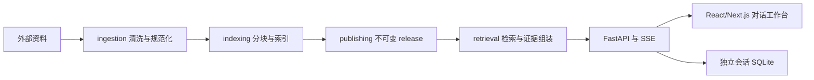
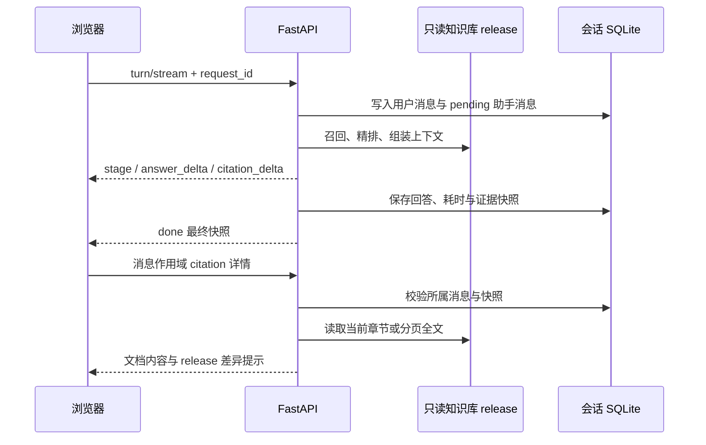

# 系统架构

## 总体形态

项目采用模块化单体。离线数据处理、发布、在线检索、API 和前端在同一仓库协作，但依赖方向和运行数据边界明确。



## 目录职责

- `backend/`：Python 包、元数据配置和测试。
- `frontend/`：对话与证据工作台。
- `infra/`：nginx、服务启动和部署资产。
- `scripts/`：仓库级测试、构建、发布、部署和回滚入口。
- `artifacts/`：只保存轻量 release 注册表。
- `docs/`：长期权威文档与 ADR。
- `openspec/`：尚未归档的变更规格和历史规格归档。

## Python 模块方向

目标依赖方向如下：

```text
domain
  ↑
infrastructure ← ingestion / indexing / publishing
  ↑
retrieval ← api ← workflows
```

- `domain` 只包含值对象、模型与无 I/O 规则。
- `infrastructure` 实现文件系统、SQLite、HTTP、模型服务和 LLM 适配器。
- `ingestion`、`indexing`、`publishing` 负责离线构建。
- `retrieval` 负责召回、重排、证据组装与回答编排。
- `api` 只调用应用/检索接口，不直接遍历语料。
- `workflows` 只做编排，不承载领域算法。

原 `service` 仅保留旧导入包装，原 `pipeline` 仅保留指向上述责任包的同文件兼容链接。算法实现只有一份；新代码不得反向依赖兼容包。兼容入口在服务器稳定运行一个发布周期后移除。

部署层把代码、制品和状态写入不可变 generation，并通过唯一 `current-generation` 符号链接完成原子切换；`current`、`current-artifact` 和两个旧目录兼容链接都是固定的间接入口。

## 在线边界

在线服务明确分成两类数据边界：

- 发布知识库保持只读。运行时通过 `BGPKB_DATA_DIR` 选择一个已验证 release；检索请求中的 SQLite、向量索引、catalog 和信任元数据必须来自同一制品适配器。
- 会话历史写入独立的 `BGP_CHAT_DB_PATH`。它不属于 release，不随代码或知识库制品切换而删除，并以 SQLite WAL、外键和 schema version 管理。

`X-BGP-Client-ID` 经加盐哈希后只用于匿名会话命名空间隔离，不是账号或身份认证。浏览器保存原始随机标识，服务端只持久化哈希。任何需要多用户权限控制的部署都必须在该边界之外增加正式认证。

回答链路通过 SSE 依次发送阶段、正文增量、引用增量和最终快照。`done` 只能在助手消息、终态、耗时和证据快照完成事务写入后发送。相同 `request_id` 的重试恢复既有轮次，并以递增 `sequence` 去重。结构化 `answer_parts` 把正文与 citation 分离，前端点击 citation 后只允许读取该助手消息作用域内的证据。



## 离线边界

离线产品流程固定为 source-ingest、canonicalize、semantic-build、publish-index、verify-release 五阶段。所有写入先进入隔离候选目录，任何阶段失败不得修改当前线上 release。候选目录、checkpoint、制品闭包和验证/回滚契约统一维护在 [RAG 五阶段流水线](pipeline.md)，本架构文档不再复制操作步骤。
